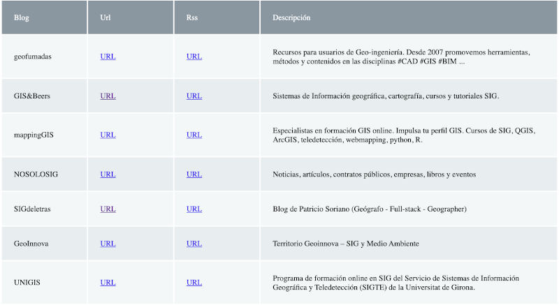

# geoiniciativas-widget

El objetivo de este proyecto es proporcionar un widget que facilite embeber los datos del [proyecto geoiniciativas](https://github.com/Geo-Developers/geoiniciativas) en cualquier web.

A continuación se puede ver una [demo](https://geo-developers.github.io/geoiniciativas-widget/).

[](https://geo-developers.github.io/geoiniciativas-widget/)

## Cómo usarlo

Simplemente tienes que copiar este código dentro de cualquier página HTML:

```html
<div class="geoiniciativas-widget" data-sheetid="1bF4YYH7bXPSLI___zMfh3tDfSxDlWWZLkkuT5vD4zHQ" data-tab="datos"></div>
<script>
    const  repoUrl = "https://geo-developers.github.io/geoiniciativas-widget",
           js = document.createElement("script");
           css = document.createElement("link");

    js.type = "text/javascript";
    js.src = repoUrl + "/geoiniciativas-widget.js";

    css.rel = "stylesheet"
    css.href = repoUrl + "/geoiniciativas-widget.css",
    
    document.querySelector("head").appendChild(js);
    document.querySelector("head").appendChild(css);
</script>
```

Reemplaza el valor del atributo "data-tab" por el nombre de la pestaña que quieras cargar.

Para las dudas/bugs/mejoras puedes abrir un issue.

## Contribuciones

### GeoEntusiastas

Si quieres ayudar con la recopilación de enlaces por favor visita: [geo-developers.github.io/geoiniciativas/#/](https://geo-developers.github.io/geoiniciativas/#/)

### Desarrolladores

Tenemos un montón de [mejoras pendientes](https://github.com/Geo-Developers/geoiniciativas-widget/issues). Si quieres ayudar con el código de este widget o con el proyecto geoiniciativas puedes hacerlo, los códigos están licenciados bajo [GPL v3.0](https://github.com/Geo-Developers/geoiniciativas-widget/blob/main/LICENSE). 

Para cualquier duda o sugerencia no dudes en contactar o abrir un issue.
